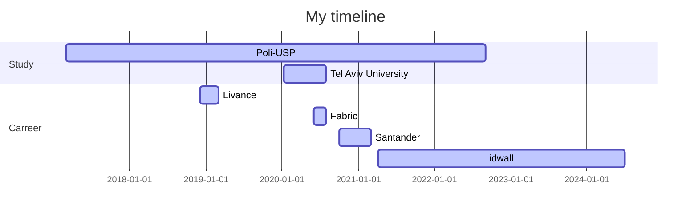

- 👋 Hi, I’m @guerchen
- 👀 I’m interested in Data Science and Software Engineering
- 🌱 I’m currently learning Machine Learning and Software development
- 💞️ I’m looking to collaborate on AI projects in general

<!---
guerchen/guerchen is a ✨ special ✨ repository because its `README.md` (this file) appears on your GitHub profile.
You can click the Preview link to take a look at your changes.
--->
